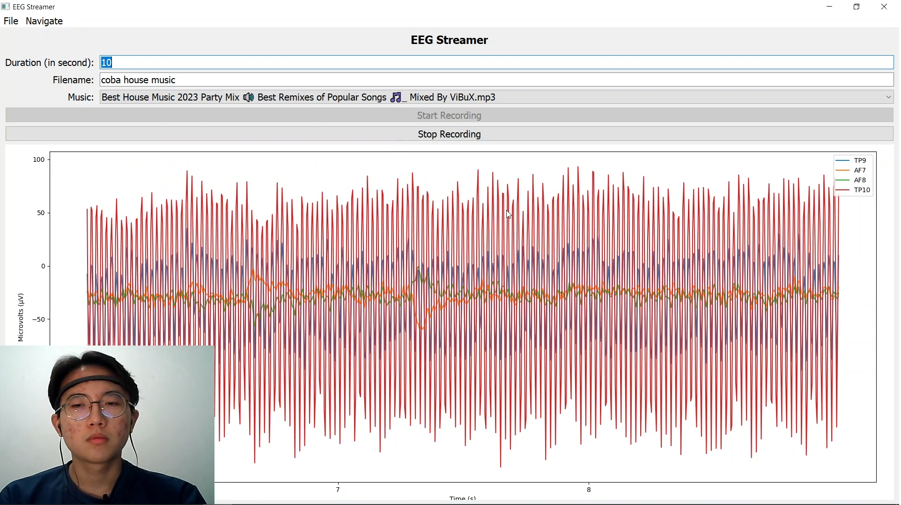

# Muse Reader
Muse Reader is a graphical user interface (GUI) application designed to record and visualize EEG (Electroencephalography) data using the Muse 2 headset. The application allows users to stream, record, and analyze EEG data in real-time, with features for playing music during recordings, visualizing raw EEG data, and generating various EEG-related plots.


## Table of Contents
- [Features](#features)
- [Requirements](#requirements)
- [Installation](#installation)
- [Usage](#usage)
- [File Structure](#file-structure)

## Features
- Real-time EEG data streaming and recording.
- Music playback during EEG recording.
- Visualization of raw EEG data.
- Generation of EEG-related plots:
  - EEG signal plot
  - Headmap plot
  - Averaged EEG plot
  - Power Spectral Density (PSD) plot
- User-friendly interface with PyQt5.
- Easy-to-use file management for saved recordings.

## Requirements
- Python 3.8+
- PyQt5
- matplotlib
- brainflow
- mne
- pyqttoast
- pygame

## Installation
1. Clone the repository:

```bash
git clone https://github.com/Kosmasu/muse-reader.git
cd muse-reader
```

2. Create a virtual environment and activate it:

```bash
python -m venv venv
source venv/bin/activate   # On Windows use `venv\Scripts\activate`
```

3. Install the required dependencies:
```bash
pip install -r requirements.txt
```
5. Ensure the Muse 2 headset is turned on.
6. Start recording!

## Usage
1. Run the application:
```bash
python eeg_streamer.py
```
2. Navigate through the application using the menu bar:
    * Recording Page: Set up and start a new EEG recording session.
    * Data Page: Load and analyze previously saved EEG recordings. 
3. Fill out the recording form:
    * Duration: Set the duration of the recording (1-3600 seconds).
    * Filename: Specify the filename for the saved recording.
    * Music: Choose a music file to play during the recording (optional).
4. Click Start Recording to begin recording EEG data. The Stop Recording button will become enabled, allowing you to end the recording session manually if needed.
5. View the real-time EEG data plot on the recording page.
6. Once the recording is finished, navigate to the Data Page to analyze and visualize the recorded data.

## File Structure
```
EEGStreamer/
│
├── recordings/          # Folder where EEG recordings are saved
├── musics/              # Folder to store music files
├── eeg_streamer.py      # Main application script
├── requirements.txt     # Required dependencies
└── README.md            # This README file
```

